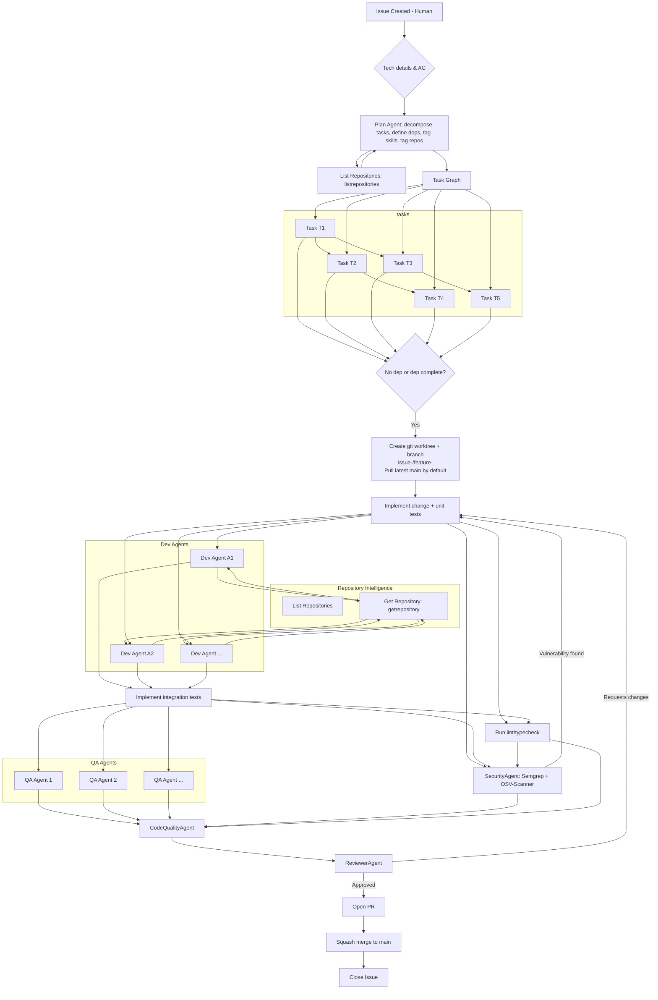

# Agentic Flow v2

This version mirrors the original flow while adding your repository-aware specialization, dependency auto-pickup, and security/CI details.

Notes

- Issues are human-authored initially; automation can be added later at the intake node.
- Plan Agent uses listrepositories to tag repos and skills; implementers call getrepository to determine specialization.
- Tasks carry explicit dependency tags so agents can auto-pick up when dependencies complete.
- Worktree tool creates branches with `issue-<id>/feature-<slug>` and pulls latest `main` by default.
- Security runs both pre-PR and on PR using Semgrep and OSV-Scanner (via local runner or CI of your choice).
- Code Quality agent runs before Reviewer to enforce linting and repository patterns.
- Reviewer is an agent; merge strategy is squash.
