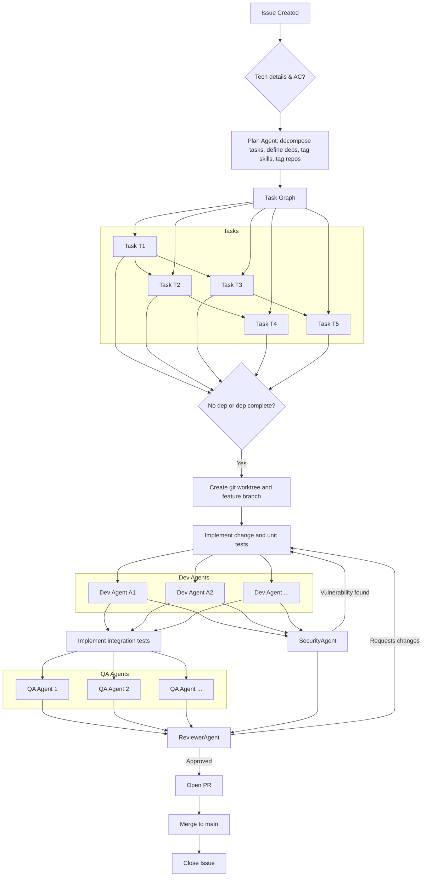

# Agentic Flow

This document provides an overview of the agentic flow and how each agent is associated to each other.

```mermaid
flowchart TD
  I[Issue Created] --> D{Tech details & AC?}
  D --> P[Plan Agent: decompose tasks, define deps, tag skills, tag repos]

  P --> TG[Task Graph]
  subgraph tasks
    direction LR
    T1[Task T1] --> T2[Task T2]
    T1 --> T3[Task T3]
    T2 --> T4[Task T4]
    T3 --> T5[Task T5]
  end
  TG --> T1
  TG --> T2
  TG --> T3
  TG --> T4
  TG --> T5

  subgraph implementers[Dev Agents]
    direction LR
    A1[Dev Agent A1]
    A2[Dev Agent A2]
    A3[Dev Agent ...]
  end

  G{No dep or dep complete?}
  T1 --> G
  T2 --> G
  T3 --> G
  T4 --> G
  T5 --> G

  G -- Yes --> WT[Create git worktree and feature branch]
  WT --> IMP[Implement change and unit tests]

  IMP --> A1
  IMP --> A2
  IMP --> A3

  A1 --> INTEG[Implement integration tests]
  A2 --> INTEG
  A3 --> INTEG

  subgraph qa_agents[QA Agents]
    direction LR
    Q1[QA Agent 1]
    Q2[QA Agent 2]
    Q3[QA Agent ...]
  end

  INTEG --> Q1
  INTEG --> Q2
  INTEG --> Q3

  S[SecurityAgent]
  A1 --> S
  A2 --> S
  A3 --> S
  S -- Vulnerability found --> IMP

  R[ReviewerAgent]
  Q1 --> R
  Q2 --> R
  Q3 --> R
  S --> R
  R -- Requests changes --> IMP

  R -- Approved --> MR[Open PR]
  MR --> MRG[Merge to main]
  MRG --> CLOSE[Close Issue]
```
